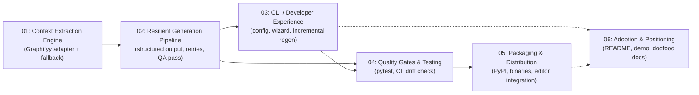

# S.C.R.I.B.E. Roadmap — Becoming the Greatest Documentation Generator Ever

This folder is the execution plan for turning the current S.C.R.I.B.E. scaffold (a working but minimal CLI: extract → prompt → LLM → write) into a tool engineers actually reach for over `Repomix`, a stale wiki page, or "just read the code."

## Current State (Assessed 2026-08-23; re-verified 2026-08-25)

> **2026-08-25 status:** Plans 01-03 are complete (see their own files for verified checkboxes).
> `src/scribe/core/` was subsequently split into `extraction/`, `providers/`, `generation/`, and
> `project/` packages -- the table below is kept as the original historical snapshot, with links
> updated to the files' current locations. Plan 04 is partially done (tests + a `[tool.ruff]`
> config exist; no CI, no coverage gate, no pre-commit yet, no `[tool.mypy]` config). Plans 05-06
> have not been started. A fresh audit on this date confirmed the single biggest open risk is
> unchanged: **no generation has ever been run against a real LLM provider** -- see
> `audit_reports/`.

The scaffold works end-to-end but has six load-bearing weaknesses:

| # | Gap | Where it lives today |
|---|-----|-----------------------|
| 1 | Graphifyy contract is guessed (`--path --format json`), unvalidated, uncached, no fallback if it's missing | [`src/scribe/extraction/extractor.py`](../src/scribe/extraction/extractor.py) *(originally `core/extractor.py`, moved during the Plan 01-03 wrap-up restructuring)* |
| 2 | One giant LLM call, positional `---` split, hard-crash on mismatch, no retries/streaming/cost control | [`src/scribe/pipeline.py`](../src/scribe/pipeline.py), [`src/scribe/generation/writer.py`](../src/scribe/generation/writer.py) |
| 3 | CLI has no config file, no wizard, no progress feedback, no incremental regen, broad `except Exception` | [`src/scribe/cli.py`](../src/scribe/cli.py) |
| 4 | Zero automated tests, zero CI, no drift detection | *(nonexistent)* |
| 5 | No distribution beyond `pip install -e .` — no PyPI, no binaries, no editor integration | *(nonexistent)* |
| 6 | README is a bare quick-start; no LICENSE, no positioning, no demo, no dogfood docs | [`README.md`](../README.md) |

Each gap gets its own plan file and a companion agent instruction file below. Plans are ordered by dependency — do them roughly in order, though 03 and 06 can run in parallel with anything.

## Roadmap

| Phase | Plan | Agent | Priority | Why it matters |
|-------|------|-------|----------|-----------------|
| 01 | [01-context-extraction-engine.md](01-context-extraction-engine.md) | [agents/01-context-extraction.agent.md](agents/01-context-extraction.agent.md) | P0 | Everything downstream depends on trustworthy graph data. Currently unvalidated raw stdout. |
| 02 | [02-resilient-generation-pipeline.md](02-resilient-generation-pipeline.md) | [agents/02-generation-pipeline.agent.md](agents/02-generation-pipeline.agent.md) | P0 | The `---` split is the single biggest reliability risk in the tool today. |
| 03 | [03-cli-developer-experience.md](03-cli-developer-experience.md) | [agents/03-cli-dx.agent.md](agents/03-cli-dx.agent.md) | P1 | Config file + incremental regen is the flagship feature that beats "flatten and re-ask" tools. |
| 04 | [04-quality-gates-and-testing.md](04-quality-gates-and-testing.md) | [agents/04-quality-testing.agent.md](agents/04-quality-testing.agent.md) | P1 | No safety net today; regressions ship silently. |
| 05 | [05-packaging-and-distribution.md](05-packaging-and-distribution.md) | [agents/05-packaging.agent.md](agents/05-packaging.agent.md) | P2 | Most ADAS engineers on this team won't have a Python dev env warmed up; a `.exe` matters more than a wheel. |
| 06 | [06-adoption-and-positioning.md](06-adoption-and-positioning.md) | [agents/06-adoption.agent.md](agents/06-adoption.agent.md) | P2 | A three-person team's tool survives on word-of-mouth; the README is the pitch deck. |
| 07 | [07-dynamic-doc-structure.md](07-dynamic-doc-structure.md) | *(none yet)* | P1 | Fixed 4/8-doc suites don't scale to real doc trees (sections with multiple pages); the structure should be derived per-repo, not templated. Added 2026-08-25, complete. |

An orchestrator agent that can walk the whole roadmap and delegate to the others lives at [agents/00-orchestrator.agent.md](agents/00-orchestrator.agent.md).

## Definition of "Greatest Documentation Generator Ever"

Concrete, testable bars — not vibes:

- [ ] **Zero-config first run**: `scribe init && scribe generate` produces usable docs with no flags beyond a repo path.
- [ ] **Never silently wrong**: malformed LLM output triggers an automatic repair pass, never a partial/garbage write to `/docs`.
- [ ] **Docs never go stale**: `scribe generate --check` can run in CI and fail a PR if code drifted from docs without a doc update.
- [ ] **Scales past one context window**: a 50k-LOC repo is chunked/summarized, not truncated or rejected.
- [ ] **Fast re-runs**: touching one file regenerates only the affected doc sections, not the whole suite (incremental mode).
- [ ] **Works for non-Python users**: a standalone binary exists so C++/C#/Unreal engineers on the team don't need a Python environment.
- [ ] **Trustworthy diagrams**: every generated Mermaid block is syntax-validated before it's written to disk.
- [ ] **Dogfooded**: S.C.R.I.B.E.'s own `/docs` are generated by S.C.R.I.B.E.

## How to Use These Files

Each `plans/*.md` is a design doc with numbered, checkbox-tracked tasks. Each `plans/agents/*.agent.md` is a ready-to-run persona for an AI coding agent that implements that plan.

These agent files live under `plans/agents/` (not `.github/agents/`) so they travel with the roadmap docs. VS Code's Copilot agent picker only discovers custom agents under `.github/agents/` or the user profile folder — if you want to invoke these directly from the agent picker or as subagents, copy the ones you need into `.github/agents/`. Until then, open the file and paste its body into a chat session, or reference it explicitly (e.g., "follow the instructions in plans/agents/01-context-extraction.agent.md").
